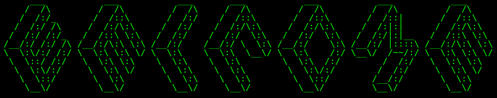

  

# About

I am a first-year PhD student at the IMT School for Advanced Studies Lucca, enrolled in the Systems Science PhD program (Software Quality track), member of the SySMA research unit.
My research interests lie in formal methods and software security. My current research work centers on static analysis techniques for detecting bugs in multi-language software. In particular, Rust programs interacting with potentially unsafe code (like C/C++).

---
# Past conferences/talks

ITASEC & SERICS JOINT NATIONAL CONFERENCE ON CYBERSECURITY - Bologna (IT), Plesso Belmeloro - Via B. Andreatta, 8 ROOM F - February 05, 2025 - 11:10 am - Preliminary paper work, *Detecting Memory Errors in Rust Programs Including Unsafe Foreign Code* - *Andrea Franceschi, Letterio Galletta and Pierpaolo Degano*     
# [Link](https://itasec.it/)