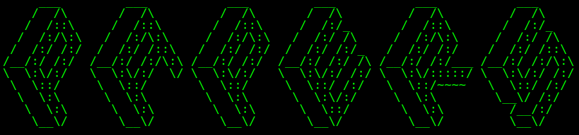

  

# Papers

- *Andrea Franceschi, Letterio Galletta, Pierpaolo Degano* - Detecting Memory Errors in Rust Programs Including Unsafe Foreign Code - 23rd International Conference on Software Engineering and Formal Methods (SEFM 2025)   
# [Download PDF](https://link.springer.com/chapter/10.1007/978-3-032-10444-1_11)

- *Andrea Franceschi, Letterio Galletta, Pierpaolo Degano* - Detecting Memory Errors in Rust Programs Including Unsafe Foreign Code(*) - ITASEC25 (Joint National Conference on Cybersecurity (ITASEC & SERICS)) 
#   [Download PDF](assets/papers/ITASEC2025_Multi_Language_Analysis.pdf)

---
(*)Oral communication/preliminary work